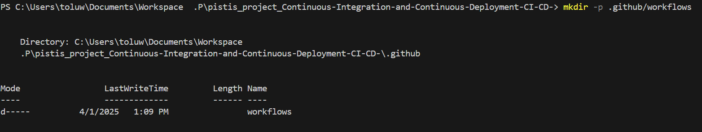
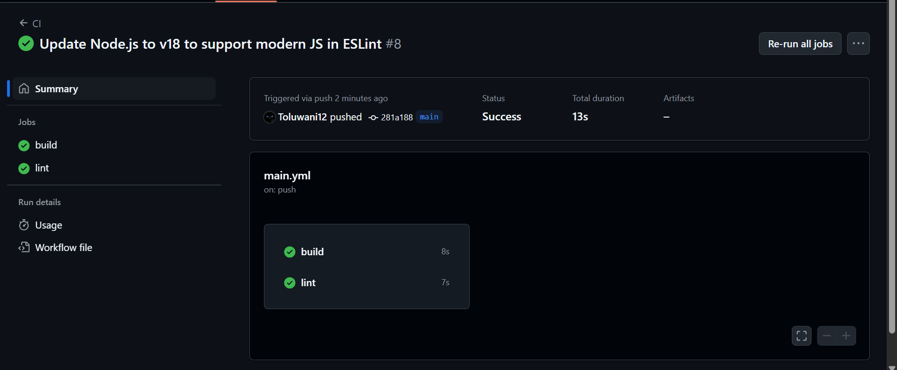
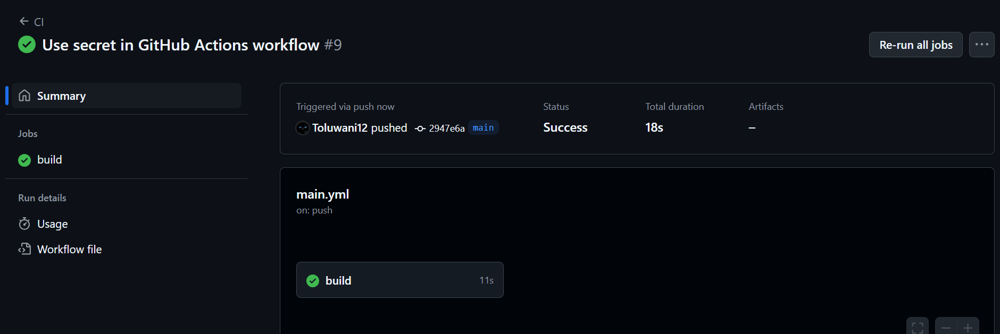

### 1. **Create a Workflow Directory:** Create a directory for your GitHub Actions workflows:
`mkdir -p .github/workflows`

    

### 2. **Create a Simple Workflow:** Create a new workflow file: `touch .github/workflows/main.yml`.
Open main.yml and add the following content:
    ```yaml
    name: CI   # The name of the workflow (CI stands for Continuous Integration)


    on: [push, pull_request]   # Triggers the workflow on every 'push' or 'pull request' to the repository

    jobs:
    build:  # The name of the job within this workflow
        runs-on: ubuntu-latest  # The job will run on the latest version of the Ubuntu runner provided by GitHub

        steps:
        # Step 1: Checkout the code from the repository
        - name: Checkout code
        uses: actions/checkout@v2   # Uses the GitHub-provided action to check out the repository's code

        # Step 2: Set up the Node.js environment
        - name: Set up Node.js
        uses: actions/setup-node@v2  # Uses the action to set up Node.js on the runner
        with:
            node-version: '14'   # Specifies that Node.js version 14 will be used

        # Step 3: Install project dependencies
        - name: Install dependencies
        run: npm install    # Runs 'npm install' to install dependencies from package.json

        # Step 4: Run the test suite
        - name: Run tests
        run: npm test  # Runs 'npm test' to execute the project's test scripts
    ```

### <mark>ERROR!!!</mark>
* After pushing it the first time I got the error: 

- **Troubleshooting:**
    * `sudo apt-get update` to get the latest url
    * `sudo apt-get install -f`

    *   `sudo apt-get clean`

        `sudo apt-get update --fix-missing`

        `sudo apt-get upgrade`
 
    * `sudo apt install npm` to install it so I'd get the `package.json` file
    * Then I edited the package.json file since I don't have real tests yet, just make the test command succeed for now to keep CI passing to:
        ```"scripts": {
        "test": "echo \"No tests yet\" && exit 0"
        }
        ```
        **exit 0** means success.

        **exit 1** means failure.

### **3. Create a Workflow with Multiple Jobs**
Open main.yml and modify it to include multiple jobs:

```yml
name: CI

on: [push, pull_request]

jobs:
  build:
    runs-on: ubuntu-latest

    steps:
    - name: Checkout code
      uses: actions/checkout@v2

    - name: Set up Node.js
      uses: actions/setup-node@v2
      with:
        node-version: '14'

    - name: Install dependencies
      run: npm install

    - name: Run tests
      run: npm test

  lint:
    runs-on: ubuntu-latest

    steps:
    - name: Checkout code
      uses: actions/checkout@v2

    - name: Set up Node.js
      uses: actions/setup-node@v2
      with:
        node-version: '14'

    - name: Run linter
      run: npm run lint
```

### <mark>ERROR!!!</mark>
* After pushing it the I got the error: 
- **Troubleshooting:**
    * `npm install eslint --save-dev`
    `npx eslint --init`
    * add this to the package.json file
    ```
    "scripts": {
        "test": "echo \"No tests yet\" && exit 0",
        "lint": "eslint ."
    }
    ```
    * Create a `.gitignore` file and paste 
    ```
    # Ignore dependencies
    node_modules/
    ```
    This basically tells git to ignore this folder and stop tracking it

    * Add this to the lint job on `main.yml` file so it installs npm or else it won't see lint
    ```
    - name: Install dependencies
      run: npm install
    ```
    
    * Also update your node version to **18** to avoid syntax error
    
**Output:**



### 4. Use Secrets in Your Workflow
Instructions:
Go to your repository’s Settings tab.

Under Security, click Secrets and variables > Actions.

Click New repository secret.

Add a new secret (for example, MY_SECRET) with a value.

Now, modify your main.yml to use the secret:

```yaml
name: CI

on: [push, pull_request]

jobs:
  build:
    runs-on: ubuntu-latest

    steps:
    - name: Checkout code
      uses: actions/checkout@v2

    - name: Set up Node.js
      uses: actions/setup-node@v2
      with:
        node-version: '18'

    - name: Install dependencies
      run: npm install

    - name: Run tests
      run: npm test

    - name: Use secret
      run: echo ${{ secrets.MY_SECRET }}
```

