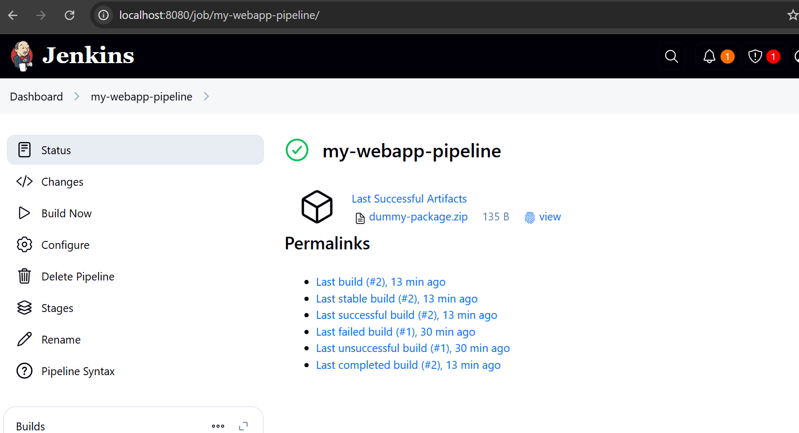

# Jenkins Critical Thinking Project

### **Scenario**
You are working as a DevOps engineer at a company that develops and maintains a web application. The application is deployed frequently, and your responsibility is to automate the CI/CD (Continuous Integration and Continuous Deployment) process using Jenkins. Your goal is to create a Jenkins pipeline that automates the following tasks to streamline the development workflow and ensure smooth deployment:

### **Pipeline Stages:**
- **Build:** Compile the source code of the web application.

- **Test:** Run automated unit tests to validate that the application behaves as expected.
- **Package**: Bundle the application into a deployable artifact, such as a Docker image or a ZIP file.
- **Deploy to Staging:** Deploy the packaged application to a staging environment for further validation.
- **Approval:** Wait for manual approval from a stakeholder or team member before proceeding to production.
- **Production Deployment:** Deploy the application to the live production environment after approval.

**Answer:**


### 🧱 1. **I installed Jenkins on Windows**

* Downloaded Jenkins `.msi` installer.
* Faced issues with:

  * User account permissions ("log on as a service")
  * Java path errors
* Resolved by:

  * Using your **Windows login password** when asked for Jenkins service account credentials.
  * Setting the correct **Java path** (e.g., `C:\Program Files\Common Files\Oracle\Java\javapath`) manually.

---

### ⚙️ 2. **I started Jenkins Successfully**

* Launched Jenkins on `http://localhost:8080`
* Completed initial setup:

  * Unlocked Jenkins with admin password.
  * Installed suggested plugins.
  * Created an admin user account.

---

### 🧪 3. **I created a Jenkins Pipeline Job**

* Clicked **"New Item"** → Selected **"Pipeline"**
* Named it `my-webapp-pipeline`

    

---

### 🛠 4. **Wrote a Simulated CI/CD Pipeline**

* Since I had no real web app or code yet, I used **dummy steps** to simulate:

| Stage                 | What it does                                                 |
| --------------------- | ------------------------------------------------------------ |
| **Build**             | Creates a fake `build.log` file                              |
| **Test**              | Simulates a test (always passes)                             |
| **Package**           | Compresses the build log into a `.zip` file using PowerShell |
| **Staging Deploy**    | Simulates deployment to a staging environment                |
| **Approval**          | Waits for manual confirmation before deploying to prod       |
| **Production Deploy** | Simulates production deployment                              |

---

### 🐛 5. **Fixed Pipeline Errors**

* Original error: `CreateProcess error=2` → Caused by using `sh` (Linux shell) on Windows.
* **Fix**: Replaced `sh` with `bat` and used PowerShell for compression.

---

### ✅ 6. **Final Working Jenkinsfile (for Windows)**

```groovy
pipeline {
    agent any

    stages {
        stage('Build') {
            steps {
                echo '🔧 Simulating build...'
                writeFile file: 'build.log', text: 'Build successful!'
            }
        }

        stage('Test') {
            steps {
                echo '🧪 Simulating test...'
                script {
                    def result = true // simulate test result
                    if (!result) {
                        error 'Tests failed!'
                    }
                }
            }
        }

        stage('Package') {
            steps {
                echo '📦 Simulating package...'
                bat 'powershell Compress-Archive -Path build.log -DestinationPath dummy-package.zip'
                archiveArtifacts artifacts: 'dummy-package.zip', fingerprint: true
            }
        }

        stage('Deploy to Staging') {
            steps {
                echo '🚀 Simulating deploy to staging...'
                writeFile file: 'staging.log', text: 'Deployed to staging successfully!'
            }
        }

        stage('Approval') {
            steps {
                input message: '✅ Approve deployment to production?', ok: 'Deploy'
            }
        }

        stage('Production Deployment') {
            steps {
                echo '🚀 Simulating deploy to production...'
                writeFile file: 'production.log', text: 'Deployed to production successfully!'
            }
        }
    }

    post {
        success {
            echo '✅ Pipeline simulation completed successfully!'
        }
        failure {
            echo '❌ Something went wrong in the simulated pipeline.'
        }
    }
}
```

